# Solution Design — Collaborative Code Editor

## 1. System Overview

A real-time collaborative code editor with Rust backend (Axum + Tokio) and React frontend (CodeMirror 6). Multiple users edit documents simultaneously in rooms, with CRDT-based conflict resolution via Yjs (yrs crate), real-time cursor sharing, and per-language linting.

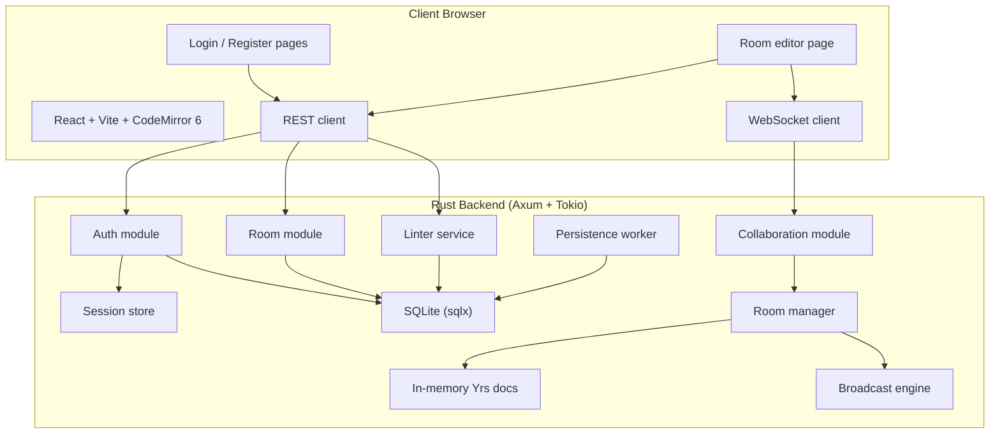

## 2. Component Architecture

### 2.1 Backend Module Boundaries

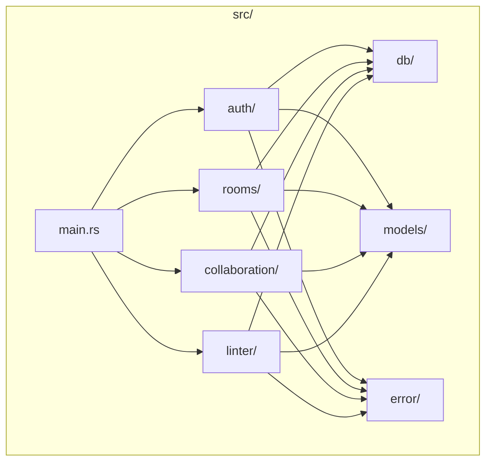

### 2.2 Room Manager Shared State

The Room Manager is the core concurrency primitive. It holds the in-memory state for all active rooms, coordinates CRDT document updates, and broadcasts changes to connected WebSocket clients.

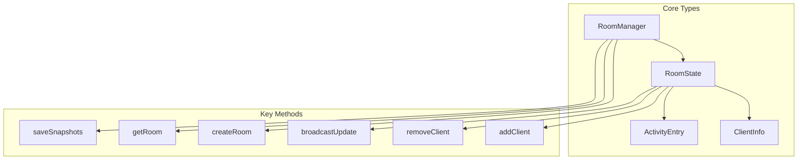

### 2.3 Concurrency Model

Each WebSocket connection gets its own Tokio task. The Room Manager uses Arc/Mutex to coordinate access to shared room state.

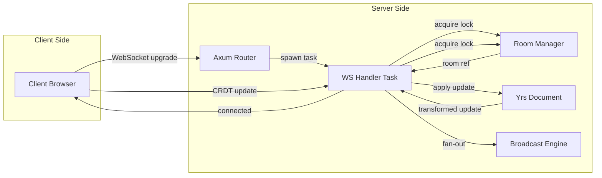

### 2.4 WebSocket Message Protocol

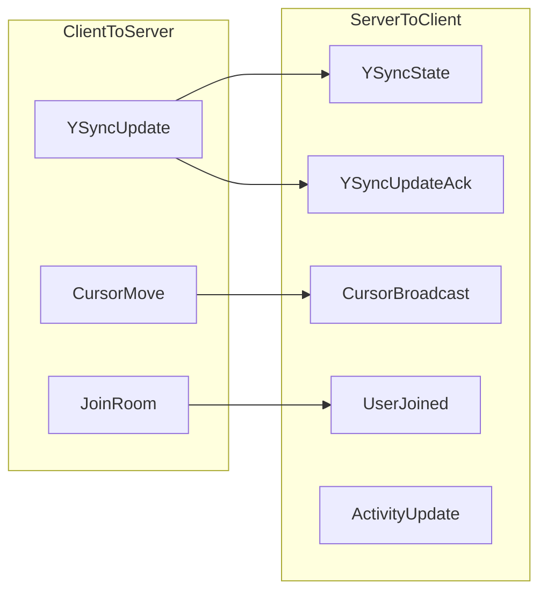

## 3. Data Flow

### 3.1 Authentication Flow

```mermaid
flowchart TD
    subgraph "Registration"
        R1["POST /api/auth/register"]
        R2["argon2.hash password"]
        R3["INSERT users"]
        R4["generate session token"]
        R5["INSERT sessions"]
        R6["Set-Cookie session_token"]
        R7["navigate to home"]
    end

    subgraph "Login"
        L1["POST /api/auth/login"]
        L2["SELECT users by username"]
        L3["argon2.verify password"]
        L4["valid?"]
        L5["generate session token"]
        L6["INSERT sessions"]
        L7["Set-Cookie session_token"]
        L8["401 Unauthorized"]
    end

    subgraph "Logout"
        LO1["POST /api/auth/logout"]
        LO2["DELETE FROM sessions"]
        LO3["clear session cookie"]
    end

    R1 --> R2 --> R3 --> R4 --> R5 --> R6 --> R7
    L1 --> L2 --> L3 --> L4
    L4 -->|"yes"| L5 --> L6 --> L7
    L4 -->|"no"| L8
    LO1 --> LO2 --> LO3
```

### 3.2 Room Lifecycle

```mermaid
flowchart TD
    subgraph "Create Room"
        C1["POST /api/rooms"]
        C2["validate session"]
        C3["INSERT rooms"]
        C4["INSERT room_members"]
        C5["create in-memory room state"]
        C6["201 {roomId, roomCode}"]
    end

    subgraph "Get Room"
        G1["GET /api/rooms/:id"]
        G2["SELECT rooms JOIN users"]
        G3["200 {metadata, members}"]
    end

    subgraph "Join Room"
        J1["WebSocket /ws/:room_id"]
        J2["add client to room"]
        J3["return YState"]
    end

    C1 --> C2 --> C3 --> C4 --> C5 --> C6
    G1 --> G2 --> G3
    J1 --> J2 --> J3
```

### 3.3 Collaborative Edit Flow

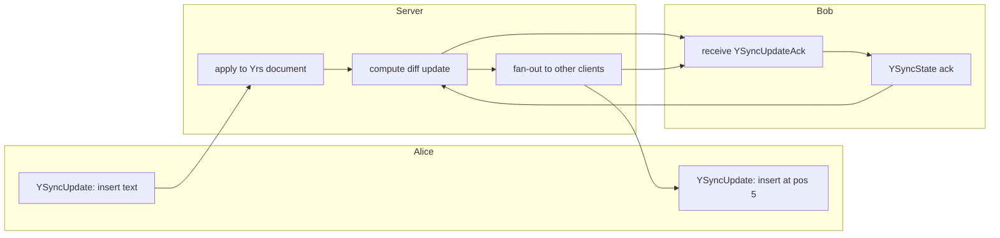

### 3.4 Linting Flow

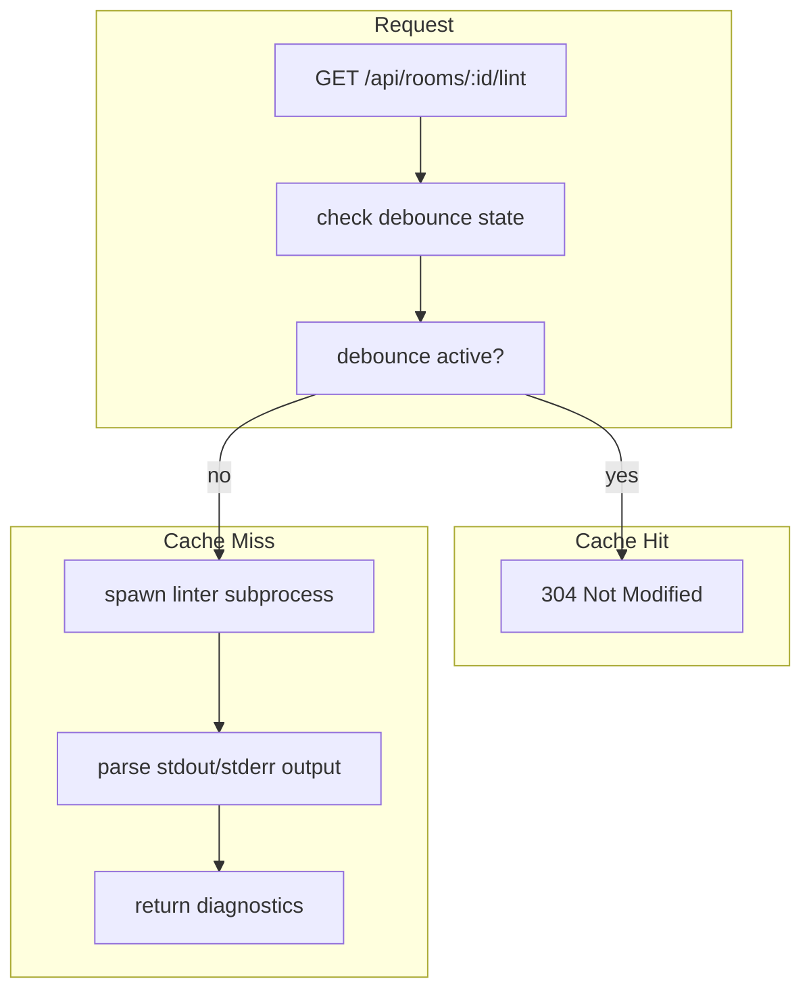

## 4. Database Design

### 4.1 Schema

| Table | Columns | Notes |
|-------|---------|-------|
| `users` | `id PK`, `username UK`, `password_hash`, `created_at` | argon2id hash |
| `sessions` | `id PK`, `user_id FK`, `token UK`, `expires_at` | TTL-based expiry |
| `rooms` | `id PK`, `code UK`, `name`, `language`, `owner_id FK`, `created_at` | unique room code |
| `room_members` | `room_id FK`, `user_id FK`, `joined_at` | composite PK |
| `documents` | `id PK`, `room_id FK`, `content_snapshot BLOB`, `version`, `saved_at` | latest snapshot only |

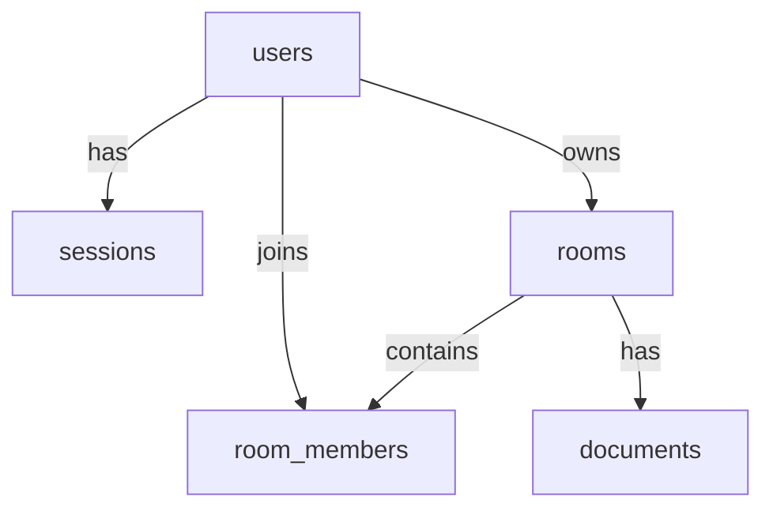

### 4.2 Migration Strategy

sqlx migrations in `migrations/` directory, versioned with timestamps.

- `001_create_users.sql` — users table
- `002_create_sessions.sql` — sessions table with TTL index
- `003_create_rooms.sql` — rooms, room_members tables
- `004_create_documents.sql` — documents table for snapshots

## 5. Frontend Architecture

### 5.1 Component Hierarchy

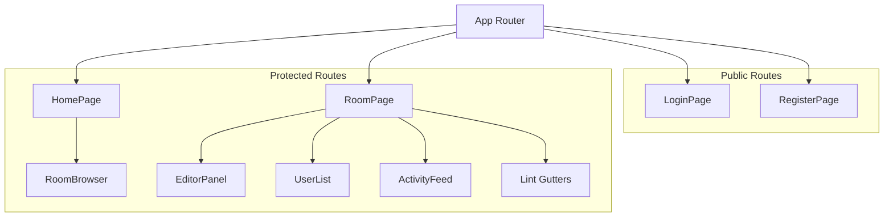

### 5.2 State Management

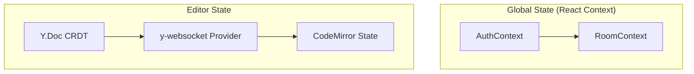

### 5.3 Custom Hooks

| Hook | Responsibility |
|------|---------------|
| `useAuth` | Session management, protected route guards |
| `useWebSocket` | WebSocket lifecycle, reconnect logic, message framing |
| `useYDoc` | Yjs document creation, sync with server, initial load |
| `useLinting` | Debounced lint requests, diagnostic state |
| `useActivityFeed` | Room activity events, scroll management |

## 6. Security Design

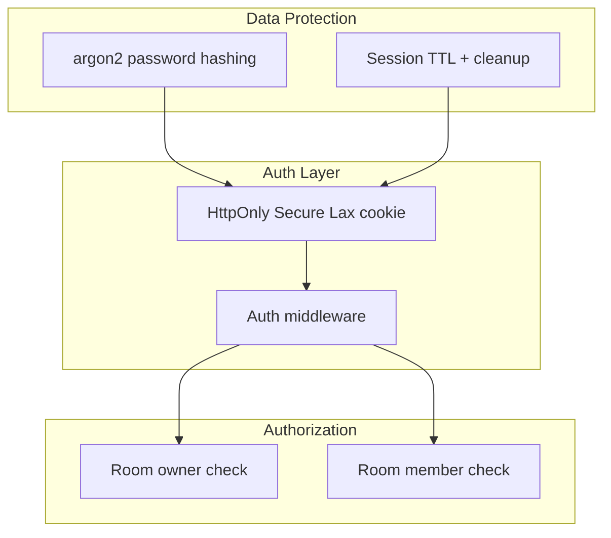

Key decisions:
- Passwords hashed with argon2id (memory-hard, GPU-resistant)
- Sessions stored in SQLite with `expires_at`; cleanup on startup + periodic interval
- Room access gated by membership check (owner always allowed; others must be in `room_members`)
- WebSocket connections require valid session cookie before upgrade

## 7. Persistence Strategy

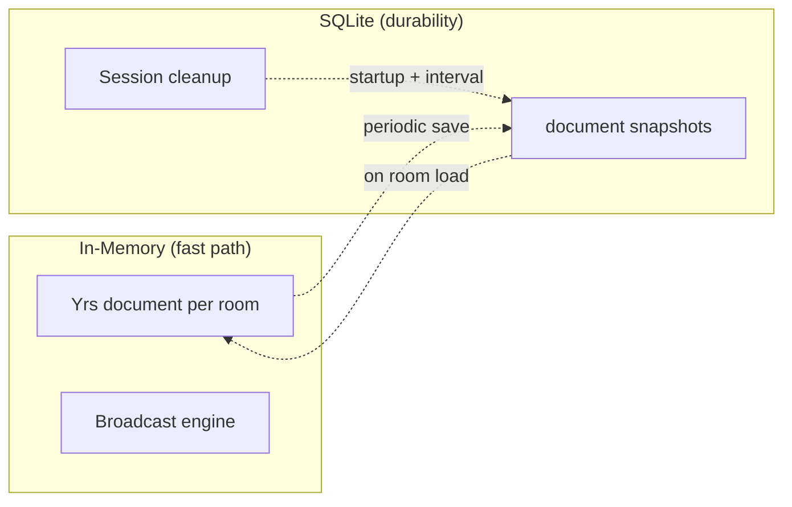

- **Save interval**: 30 seconds (configurable)
- **Save strategy**: Full document snapshot (Yrs state vector + content)
- **Restore**: On room join, load latest snapshot, apply any pending updates
- **Session cleanup**: Delete expired sessions on startup + every 5 minutes

## 8. Error Handling Strategy

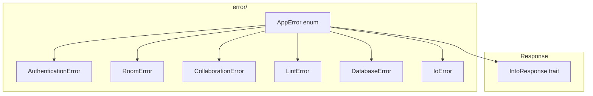

- Single `AppError` enum with `thiserror` derives
- Implements `IntoResponse` for Axum
- Categories: auth failures, room not found, WS protocol errors, lint failures, DB errors, I/O errors
- Debug mode returns detailed messages; release mode sanitizes

## 9. Configuration

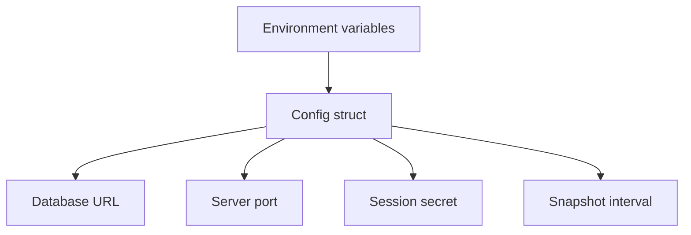

- `.env` file (not committed, referenced in `.gitignore`)
- Config loaded at startup via `dotenv` + `serde`
- Required: `DATABASE_URL`, `SESSION_SECRET`, `PORT` (default 3000)
- Development defaults: `DATABASE_URL=sqlite://collab_editor.db`, `PORT=3000`, `SNAPSHOT_INTERVAL=30s`
