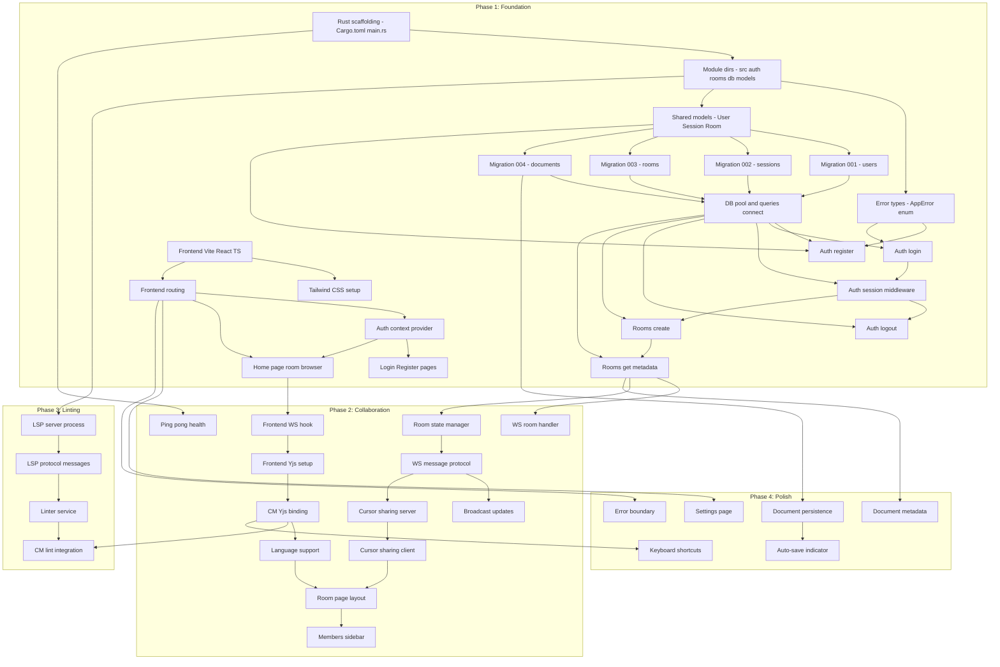

# Task Breakdown — Collaborative Code Editor

52 tasks across 4 phases. Each task is scoped for 30min–2h of implementation.

---

## Phase 1 — Foundation

| ID | Task | Summary | Time | Depends On | Status |
|----|------|---------|------|------------|--------|
| P1-T01 | Rust project scaffolding | `Cargo.toml` with all dependencies (Axum, Tokio, sqlx, yrs, argon2, serde, tokio-tungstenite, tower-http, uuid, serde_json, tracing). `src/main.rs` with Axum `Router::new()` skeleton, `build_app()` function returning `AxumState`, empty `tokio::main()`. | 1h | — | ✅ Done |
| P1-T02 | Module directory structure | Create `src/auth/`, `src/rooms/`, `src/collaboration/`, `src/linter/`, `src/db/`, `src/models/`, `src/error/`. Add `mod.rs` in each. Add `migrations/` with `00000000000000_initial.sql` placeholder. | 30min | — | ⬜ Todo |
| P1-T03 | Error types module | `src/error/mod.rs`: `AppError` enum with `thiserror` derives for `AuthError`, `RoomError`, `CollabError`, `LintError`, `DbError`, `IoError`. Implement `IntoResponse` via `axum::response::Response`. Map each variant to correct HTTP status code. | 1h | P1-T02 | ⬜ Todo |
| P1-T04 | Shared models | `src/models/mod.rs`: Serde-serializable structs — `User`, `Session`, `Room`, `RoomMember`, `Document`. Re-export all. Add `RoomMemberType` enum (owner, editor, viewer). | 1h | P1-T02 | ⬜ Todo |
| P1-T05 | Migration 001 — users | `migrations/001_create_users.sql`: `CREATE TABLE users (id INTEGER PRIMARY KEY AUTOINCREMENT, username TEXT UNIQUE NOT NULL, password_hash TEXT NOT NULL, created_at DATETIME DEFAULT CURRENT_TIMESTAMP)`. | 30min | P1-T04 | ⬜ Todo |
| P1-T06 | Migration 002 — sessions | `migrations/002_create_sessions.sql`: `CREATE TABLE sessions (id INTEGER PRIMARY KEY AUTOINCREMENT, user_id INTEGER NOT NULL REFERENCES users(id), token TEXT UNIQUE NOT NULL, expires_at DATETIME NOT NULL, created_at DATETIME DEFAULT CURRENT_TIMESTAMP)`. | 30min | P1-T04 | ⬜ Todo |
| P1-T07 | Migration 003 — rooms | `migrations/003_create_rooms.sql`: `rooms` table (id, code, name, description, language, owner_id, created_at) + `room_members` table (id, room_id, user_id, member_type, created_at). | 30min | P1-T04 | ⬜ Todo |
| P1-T08 | Migration 004 — documents | `migrations/004_create_documents.sql`: `documents` table (id, room_id, content_snapshot BLOB, version INTEGER DEFAULT 0, saved_at DATETIME DEFAULT CURRENT_TIMESTAMP). | 30min | P1-T04 | ⬜ Todo |
| P1-T09 | DB connection pool + migrations | `db/mod.rs`: `connect(url)` returning `SqlitePool` from `sqlx::pool::PoolOptions::new()`. Call `sqlx::migrate!().run()` in `connect()`. `db/queries.rs`: raw sqlx helpers — `create_user`, `get_user_by_username`, `insert_session`, `get_session_by_token`. | 1h | P1-T05, P1-T06, P1-T07, P1-T08 | ⬜ Todo |
| P1-T10 | Auth — registration | `auth/register.rs`: `POST /api/auth/register` handler. Validate input (username format, password length 6+). Hash with argon2id. INSERT user + session via `db/queries`. Set `Set-Cookie` header with HttpOnly, Secure, SameSite=Lax. Return 201 with user data. | 1.5h | P1-T03, P1-T04, P1-T09 | ⬜ Todo |
| P1-T11 | Auth — login | `auth/login.rs`: `POST /api/auth/login` handler. SELECT user by username. Verify password with argon2 `verify()`. Generate random session token. INSERT session. Set `Set-Cookie` header. Return 401 on failure with `AppError::AuthError`. | 1.5h | P1-T09 | ⬜ Todo |
| P1-T12 | Auth — session middleware | `auth/session.rs`: Axum `extract::FromRequest` for `ValidSession`. Reads `session` cookie, calls `get_session_by_token`, validates expiry, returns `User` or `AuthError::Unauthorized`. | 1.5h | P1-T11, P1-T09 | ⬜ Todo |
| P1-T13 | Auth — logout | `auth/logout.rs`: `POST /api/auth/logout` handler. Read session token from cookie, DELETE from DB. Set `Set-Cookie` with `Max-Age=0` to clear. Return 200. | 30min | P1-T12, P1-T09 | ⬜ Todo |
| P1-T14 | Rooms — create | `rooms/create.rs`: `POST /api/rooms` (protected). Generate 6-char alphanumeric code with `uuid`. INSERT rooms + room_members (owner). Return 201 with `{roomId, roomCode, name}`. | 1.5h | P1-T12, P1-T09 | ⬜ Todo |
| P1-T15 | Rooms — get metadata | `rooms/get.rs`: `GET /api/rooms/:id` handler. SELECT rooms JOIN users ON owner. Return `{id, code, name, description, language, owner, members, latestDocumentSnapshot}`. Returns 404 if not found. | 1h | P1-T14, P1-T09 | ⬜ Todo |
| P1-T16 | Frontend — Vite + React + TS | `npm create vite@latest frontend -- --template react-ts`. Install `@codemirror/lang-javascript`, `@codemirror/lang-python`, `@codemirror/lang-rust`, `@codemirror/commands`, `@codemirror/language`, `@codemirror/lint`, `@codemirror/view`, `@codemirror/state`, `yjs`, `y-websocket`, `react-router-dom`. | 1h | — | ⬜ Todo |
| P1-T17 | Tailwind CSS setup | Install Tailwind + PostCSS. Create `tailwind.config.js`, `postcss.config.js`. `index.css` with `@tailwind` directives. Add global CSS variables for theme tokens (light/dark). | 1h | P1-T16 | ⬜ Todo |
| P1-T18 | Frontend routing | `react-router-dom` v6. `src/pages/`: `HomePage`, `LoginPage`, `RegisterPage`, `RoomPage`. `src/components/ProtectedRoute.tsx` that checks auth context and redirects to login. | 1h | P1-T16 | ⬜ Todo |
| P1-T19 | Auth context + provider | `src/contexts/AuthContext.tsx`: React context with `user`, `login(username, password)`, `register(username, password)`, `logout()`. Persists session via HttpOnly cookie (handled automatically by browser/axum). | 1.5h | P1-T18 | ⬜ Todo |
| P1-T20 | Login + Register pages | `src/pages/LoginPage.tsx` and `src/pages/RegisterPage.tsx`. Tailwind styled form components. Form validation (username format, password length 6+). Inline error display. Shared `AuthForm` base component. | 1.5h | P1-T19 | ⬜ Todo |
| P1-T21 | Home page + room browser | `src/pages/HomePage.tsx`: room list with "Create Room" and "Join Room" forms. `src/components/RoomCard.tsx` showing room name, code, member count. "Create Room" sends `POST /api/rooms`, "Join Room" sends `POST /api/rooms/join`. Navigate to room page on success. | 1.5h | P1-T19 | ⬜ Todo |

---

## Phase 2 — Collaboration

| ID | Task | Summary | Time | Depends On | Status |
|----|------|---------|------|------------|--------|
| P2-T01 | WebSocket room handler | `collaboration/ws.rs`: `ws_handler(roomId)` with `tokio_tungstenite`. On connect: check room exists, create `yrs::Doc` per room, add to room state map. On disconnect: clean up room state. | 1.5h | P1-T15 | ⬜ Todo |
| P2-T02 | Room state manager | `collaboration/room_state.rs`: `RoomState` struct wrapping `Arc<RwLock<RoomStateInner>>`. `Inner` has `yrs::Doc`, `HashMap<ClientId, yrs::sync::Awareness>`, `HashSet<AxumStream>`. Methods: `add_client`, `remove_client`, `get_update_diff`, `apply_update`, `broadcast`. | 2h | P2-T01 | ⬜ Todo |
| P2-T03 | WS message protocol | Define `WsMessage` enum (text): `SyncMessage`, `AwarenessMessage`, `CursorMessage`. On connect: send initial state via `encode_state_as_update_v1`. Subscribe to `doc.observe_update_v1` for incremental sync. | 1.5h | P2-T02 | ⬜ Todo |
| P2-T04 | Broadcast updates | In `ws_handler`, on `observe_update_v1` callback: `RoomState::broadcast` the update bytes to all connected clients except sender. Add backpressure — skip client if send queue > 100 messages. | 1h | P2-T03 | ⬜ Todo |
| P2-T05 | WS ping/pong + health | In `ws_handler`: 30s interval `ping` messages. On `pong` timeout: close connection. On `Text(Ping(...))`: reply with `Text(Pong(...))`. Prevents stale connections from consuming resources. | 30min | P2-T01 | ⬜ Todo |
| P2-T06 | Frontend WebSocket hook | `src/hooks/useWebSocket.ts`: `const {sendMessage, reconnect} = useWebSocket(roomId, onSyncUpdate)`. Manages `WebSocket` connection URL (`ws://host/ws/room/:id`). Handles reconnect with exponential backoff (1s → 2s → 4s → max 30s). | 1.5h | P1-T21 | ⬜ Todo |
| P2-T07 | Frontend Yjs setup | `src/collab/useYjs.ts`: Creates `Y.Doc`, `Y.getText('content')`, `Y.Map('awareness')`. On WS message: `Y.applyUpdate(doc, msg.data)`. On `doc.on('update')`: `ws.sendMessage(SyncMessage(update))`. | 1.5h | P2-T06 | ⬜ Todo |
| P2-T08 | CodeMirror + Yjs binding | `src/collab/cm-yjs-binding.ts`: Create `EditorView` with `basicSetup`. Use `yjs-bindings` approach — bind `YText` to CodeMirror state via `updateListener` that detects `transaction.origin` and syncs changes. | 1.5h | P2-T07 | ⬜ Todo |
| P2-T09 | CodeMirror language support | `src/collab/languages.ts`: Map `room.language` to CodeMirror language extension. `@codemirror/lang-javascript` for JS/TS, `@codemirror/lang-python` for Python, `@codemirror/lang-rust` for Rust. Default to plain text. | 1h | P2-T08 | ⬜ Todo |
| P2-T10 | Cursor sharing — server | In `RoomState::Awareness`: store `cursorPos`, `selection` per client. On WS `CursorMessage`: update Awareness, broadcast `AwarenessMessage` (delta format) to all clients. | 1h | P2-T03 | ⬜ Todo |
| P2-T11 | Cursor sharing — client | `src/collab/cursor-renderer.tsx`: `useEffect` on Awareness changes: render remote cursors as absolute-positioned overlays in the editor container. Each cursor shows username + colored caret. | 1.5h | P2-T10 | ⬜ Todo |
| P2-T12 | Frontend room page layout | `src/pages/RoomPage.tsx`: full-width `EditorLayout` component. Integrates `useYjs`, `useWebSocket`. Passes `YText` to `CodeMirrorEditor`. Displays online members sidebar. | 1h | P2-T09, P2-T11 | ⬜ Todo |
| P2-T13 | Members sidebar | `src/components/MembersSidebar.tsx`: list of online members with colored dots, username, role badge. Shows "Leave Room" button. "Add Member" form with username input. | 1h | P2-T12 | ⬜ Todo |

---

## Phase 3 — Linting

| ID | Task | Summary | Time | Depends On | Status |
|----|------|---------|------|------------|--------|
| P3-T01 | LSP server process | `linter/server.rs`: `LspProcess` struct spawning external `rust-analyzer`, `pyright`, or `eslint` via `tokio::process::Command`. Write stdin/stdout streams to `mpsc::channel`. | 1.5h | P1-T02 | ⬜ Todo |
| P3-T02 | LSP protocol messages | `linter/protocol.rs`: LSP JSON-RPC envelope type. `initialize()` → `capabilities` response. `textDocument/didOpen(content, language)`, `textDocument/didChange(content, language)` on document changes. | 1.5h | P3-T01 | ⬜ Todo |
| P3-T03 | Linter integration with rooms | `linter/service.rs`: `LintService::spawn(roomId, language)`. On room creation: start LSP process. On WS message with file content: forward to LSP via stdin, parse diagnostics from stdout JSON, broadcast back as `LintMessage`. | 1.5h | P3-T02 | ⬜ Todo |
| P3-T04 | CodeMirror lint integration | `src/collab/lint-integration.ts`: `createLinter()` using `@codemirror/lint`. Subscribe to WS `LintMessage` events: `lintState.update(lintMessages)`. Style diagnostic lines with Tailwind colors (red for errors, yellow for warnings). | 1.5h | P3-T03 | ⬜ Todo |

---

## Phase 4 — Polish

| ID | Task | Summary | Time | Depends On | Status |
|----|------|---------|------|------------|--------|
| P4-T01 | Document persistence | `db/queries.rs`: `save_document(roomId, contentSnapshot)` — BLOB INSERT/REPLACE. `get_latest_document(roomId)` — latest row SELECT. Call `save_document` every 30s + on room close via `tokio::task::spawn`. | 1.5h | P1-T08 | ⬜ Todo |
| P4-T02 | Auto-save indicator | `src/components/AutoSaveIndicator.tsx`: shows "Saving...", "Saved", "Unsaved changes" with icon. Tied to WS message send timestamps — pulse green on save confirm. | 30min | P4-T01 | ⬜ Todo |
| P4-T03 | Document metadata | `rooms/metadata.rs`: `GET /api/rooms/:id/metadata` — returns `{name, description, language, owner, members, version, lastSavedAt}`. Room edit: `PATCH /api/rooms/:id` — update name/description/language. | 1h | P1-T15 | ⬜ Todo |
| P4-T04 | Settings page | `src/pages/SettingsPage.tsx`: tabbed layout. Tab 1: account (username, change password). Tab 2: editor (font size 12-20, tab width 2-4, theme toggle). Tab 3: notifications. Persists to localStorage. | 1.5h | P1-T18 | ⬜ Todo |
| P4-T05 | Keyboard shortcuts | `src/hooks/useKeyboardShortcuts.ts`: Ctrl+S save, Ctrl+/ toggle comments, Ctrl+Z/Y undo/redo (pass through to CodeMirror `basicSetup`). Ctrl+Shift+F find/replace via CodeMirror search add-on. | 1h | P2-T08 | ⬜ Todo |
| P4-T06 | Error boundary + loading | `src/components/ErrorBoundary.tsx`: catches React errors, shows fallback with "Try again" button. `src/components/LoadingSpinner.tsx`: centered spinner for auth loading, room loading, editor loading states. | 30min | P1-T18 | ⬜ Todo |

---

## Dependency Diagram



---

## Task Summary by Phase

| Phase | Tasks | Total Time | Key Deliverables |
|-------|-------|------------|-----------------|
| P1 Foundation | 21 tasks | ~24h | Rust project, auth endpoints, room endpoints, frontend scaffolding, routing, auth pages |
| P2 Collaboration | 13 tasks | ~20h | WebSocket server, room state manager, CRDT sync, CodeMirror binding, cursor sharing |
| P3 Linting | 4 tasks | ~6h | LSP process, protocol messages, linter service, CodeMirror lint integration |
| P4 Polish | 6 tasks | ~7h | Document persistence, auto-save, settings, shortcuts, error handling |
| **Total** | **52 tasks** | **~57h** | Complete collaborative code editor |

## Implementation Order (Critical Path)

The critical path through all phases:

```
T01 → T02 → T04 → T05/06/07/08 → T09 → T11 → T12 → T14 → T15
                              → T10 → T13
T16 → T17, T18 → T19 → T20, T21

P2T1 → P2T2 → P2T3 → P2T4 → P2T5
P2T6 → P2T7 → P2T8 → P2T9 → P2T12 → P2T13
P2T10 → P2T11

P3T1 → P3T2 → P3T3 → P3T4
P3T4 ← P2T8

P4T1 → P4T2
P4T3, P4T4, P4T5, P4T6
```

Start with Phase 1 tasks in parallel where dependencies allow, then proceed through each phase.
